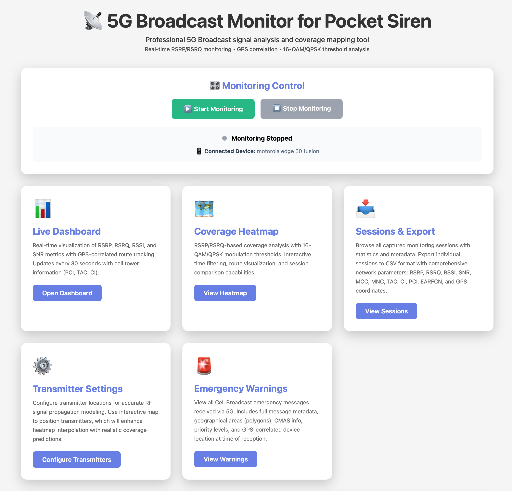
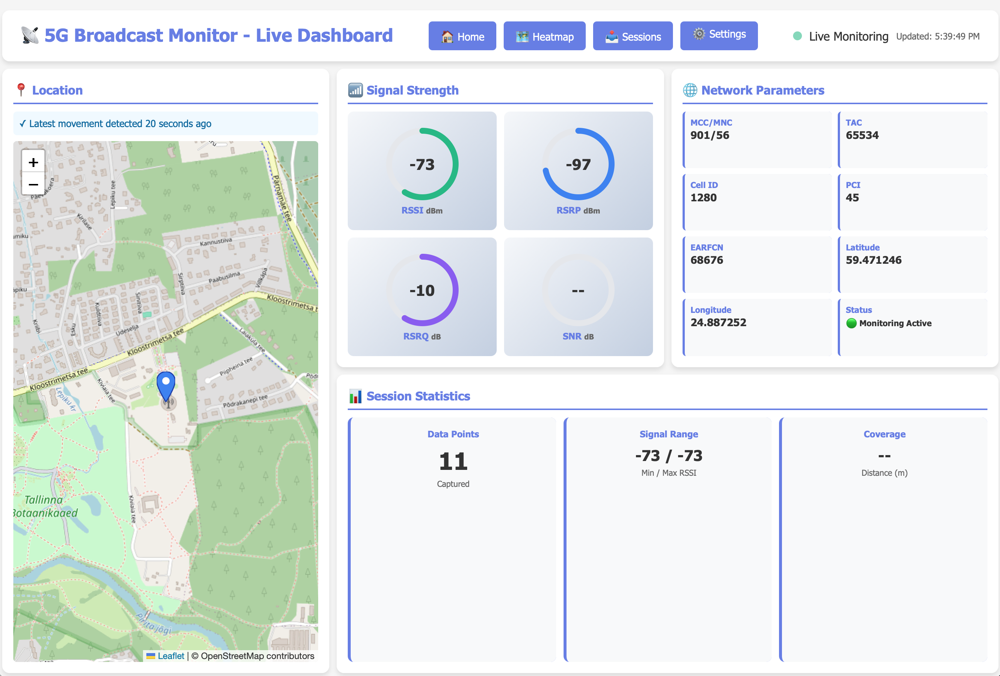
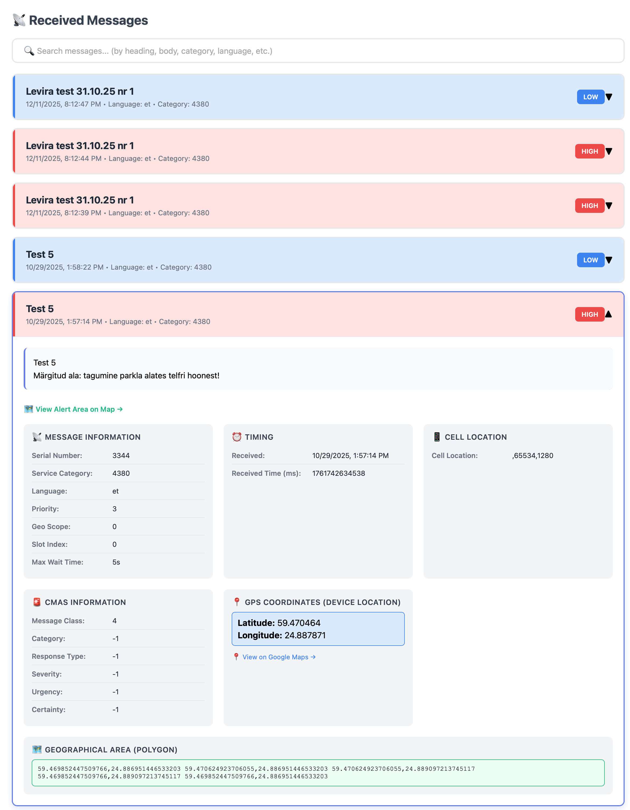
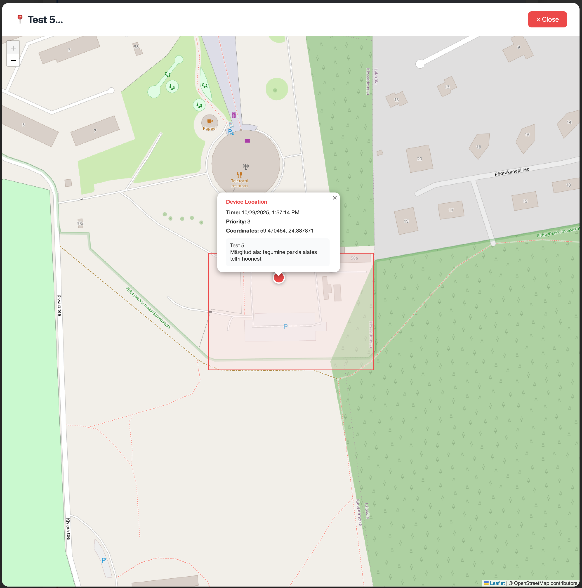

# 📡 5G Broadcast Monitor

Professional 5G Broadcast signal analysis and coverage mapping tool for real-time RSRP/RSRQ monitoring with GPS correlation and modulation threshold analysis.


## 📸 Screenshots

### Main Interface

*Central hub with monitoring control, dashboard access, heatmap viewer, and emergency warnings*

### Live Dashboard

*Real-time signal gauges (RSSI, RSRP, RSRQ, SNR), GPS tracking, and session statistics*

### Coverage Heatmap

*Signal strength visualization with 16-QAM/QPSK modulation thresholds and transmitter filtering*

### Emergency Warnings
<table>
<tr>
<td width="50%">


*Cell Broadcast message list with priority indicators*

</td>
<td width="50%">


*Detailed CB message view with CMAS info, GPS location, and geo polygon*

</td>
</tr>
</table>


*Emergency warnings mapped with geographical coverage areas*

## 🌟 Features

### Desktop Monitoring (ADB-based)
- **Real-time Signal Monitoring** - RSRP, RSRQ, RSSI, SNR metrics via ADB
- **GPS-Correlated Tracking** - High-precision location data with route visualization
- **Interactive Heatmap** - Coverage analysis with 16-QAM/QPSK modulation thresholds
- **Live Dashboard** - Real-time gauges, network info, and session statistics
- **Session Management** - Automatic logging, indexing, and historical replay
- **Web Control Interface** - Start/stop monitoring, device status, and session browser
- **CSV Export** - Full parameter export for post-processing and reporting
- **Modulation Analysis** - Signal quality classification based on 3GPP standards
- **🚨 Emergency Warnings (NEW!)** - Cell Broadcast message monitoring and analysis

### 📱 Native Android App
- **Standalone Monitoring** - No PC or ADB required, runs independently on your phone
- **Background Logging** - Continues monitoring with screen off using foreground service
- **Robust Network Collection** - Retry mechanism with exponential backoff for reliable data
- **Battery Optimization** - Requests Doze mode exemption for uninterrupted monitoring
- **Live Cell View** - Real-time display of signal metrics and GPS status
- **Automatic File Export** - Saves logs to device storage in JSONL format
- **Session Management** - Compatible with desktop heatmap viewer
- **📱 Multi-Phone Support (NEW in v1.3.2!)** - Device name prefix for log separation
  - Automatically uses device name from phone settings
  - Network logs: `{deviceName}_{timestamp}.jsonl`
  - CB logs: `{deviceName}_{timestamp}_{serialNumber}.json`
  - No conflicts when using multiple phones
- **🚨 CB Logging (NEW in v1.3!)** - Automatic Cell Broadcast message capture on device
  - Logcat-based CB monitoring (requires READ_LOGS permission via ADB)
  - BroadcastReceiver for direct CB message capture
  - GPS-correlated emergency alert logging
  - Import to web interface via ADB

### 🚨 Cell Broadcast Emergency Warnings (NEW in v1.3!)
- **Desktop CB Monitoring** - Automatic capture of Cell Broadcast messages via ADB logcat
- **Android App CB Logging** - Direct on-device CB capture (requires READ_LOGS permission)
  - Enable via: `adb shell pm grant ee.levira.cbmonitor android.permission.READ_LOGS`
  - Import to web via "Import from Phone" button
- **Complete Metadata** - Serial number, service category, priority, language, CMAS info
- **Geographical Areas** - Full polygon coordinates for targeted alert zones
- **GPS Correlation** - Device location at time of message reception
- **Message History** - Browse all received CB messages with timestamps
- **Import Tool** - Batch import from existing CB log dump files or Android app
- **Web Interface** - Dedicated emergency warnings viewer with expandable details
- **Multi-language Support** - Displays messages in Estonian, English, Russian

## 📁 Project Structure

```
cb_monitor/
├── cb_monitor.py               # Main monitoring backend (ADB + CB logcat)
├── api_server.py               # Web API server with control endpoints
├── import_cb_logs.py           # Cell Broadcast log importer
├── start.sh                    # Quick-start script (starts web API server)
├── index.html                  # Main control interface
├── dashboard.html              # Live monitoring dashboard
├── heatmap.html                # Coverage heatmap viewer
├── emergency_warnings.html     # Cell Broadcast message viewer (NEW!)
├── sessions.html               # Session browser and export
├── settings.html               # Transmitter configuration (tower locations & PCI)
├── android_app/                # Native Android app (standalone monitoring)
│   ├── app/src/main/java/ee/levira/cbmonitor/
│   │   ├── MainActivity.kt          # App UI and controls
│   │   ├── MonitoringService.kt     # Background monitoring service
│   │   ├── CellBroadcastReceiver.kt # CB message receiver (NEW!)
│   │   └── LogcatCBLogger.kt        # Logcat-based CB capture (NEW!)
│   ├── app/build/outputs/apk/debug/
│   │   └── app-debug.apk            # Pre-built APK for installation
│   └── CB_LOGGING_SETUP.md     # CB logging setup guide (NEW!)
├── data/                       # Generated data files
│   ├── status.json            # Current live status (with session_id)
│   ├── data_index.json        # Session index and metadata
│   └── cb_index.json          # Cell Broadcast message index (NEW!)
├── logs/                       # Session log files (.jsonl)
├── cb_logs/                    # Cell Broadcast messages (.json) (NEW!)
├── cb_dumps/                   # CB log dump files for import (NEW!)
├── static/                     # Additional static assets (if any)
├── favicon.svg                 # App icon
└── test_phone.py              # Device testing utilities
```

## 📲 Android App Installation

### Download Pre-built APK

**Direct Download:**
[📥 Download app-debug.apk](https://github.com/kkaasan/5GBC_phone_monitor/raw/main/android_app/app/build/outputs/apk/debug/app-debug.apk)

### Installation Steps

1. **Enable Unknown Sources** (if not already enabled)
   - Go to Settings → Security → Install unknown apps
   - Select your browser or file manager
   - Allow installation from this source

2. **Download and Install**
   - Click the download link above on your Android device
   - Or transfer the APK file to your phone via USB/cloud storage
   - Tap the APK file to install
   - Accept permissions when prompted

3. **Grant Permissions**
   - Location (Fine & Background) - Required for GPS data
   - Phone State - Required for network signal data
   - Battery Optimization Exemption - Recommended for reliable background monitoring

4. **Start Monitoring**
   - Open the app
   - Tap "Start Logging"
   - Grant battery optimization exemption when prompted
   - The app will log data every 30 seconds to device storage

### Accessing Logs

Logs are saved to: `/storage/emulated/0/Android/data/ee.levira.cbmonitor/files/cb_monitor/`

You can:
- Copy logs to PC via USB
- Import into desktop heatmap viewer
- View with any text editor (JSONL format)

### Features

- ✅ **Background Monitoring**: Continues with screen off via foreground service
- ✅ **Retry Logic**: Exponential backoff (2-12s timeouts) for reliable cell data
- ✅ **Stale Detection**: Automatically detects and refreshes stale network data
- ✅ **Battery Optimized**: Requests Doze mode exemption for uninterrupted monitoring
- ✅ **Live Display**: Real-time signal metrics and GPS status
- ✅ **Green Border**: 5dp border indicates active logging
- ✅ **Compatible Format**: JSONL logs work with desktop heatmap viewer

## 🚀 Quick Start (Desktop Monitoring)

### Prerequisites

1. **Android SDK Platform Tools** (ADB)
   ```bash
   # macOS with Homebrew
   brew install android-platform-tools

   # Or download from:
   # https://developer.android.com/studio/releases/platform-tools
   ```
   ```powershell
   # Windows (PowerShell)
   winget install --id=Google.PlatformTools
   # Or download the ZIP from the link above and add adb.exe to PATH
   ```

2. **Python 3.7+** (no external packages required)

3. **Android Phone** with:
   - USB debugging enabled
   - Location services enabled
   - N71 band supported device (required for 5G Broadcast)

### Installation

```bash
# Clone the repository
git clone git@github.com:kkaasan/5GBC_phone_monitor.git
cd 5GBC_phone_monitor

# Connect your phone via USB and enable USB debugging
# Accept the "Allow USB debugging" prompt on your phone

# Start the web server (macOS/Linux)
# Monitoring is controlled from the web UI (Home page)
./start.sh

# Start the web server (Windows)
python api_server.py 8888
```

### Access the Interface

Open your browser and navigate to:
- **Main Menu**: http://localhost:8888/index.html
- **Live Dashboard**: http://localhost:8888/dashboard.html
- **Coverage Heatmap**: http://localhost:8888/heatmap.html
- **🚨 Emergency Warnings**: http://localhost:8888/emergency_warnings.html
- **Sessions & Export**: http://localhost:8888/sessions.html

### Multi-Phone Setup (v1.3.2)

When using multiple phones, set unique device names to separate logs:

**On each Android phone:**
1. Go to: **Settings → About Phone → Device name**
2. Set unique names like: `Pixel3`, `Phone1`, `TestDevice`

**Result:**
- Network logs: `pixel3_20251230_073318.jsonl`
- CB logs: `pixel3_20251029_132113_3312.json`
- No filename conflicts when importing from multiple devices
- Easy identification of which phone created which logs

## 📊 Web Interface

### 1. Main Control Interface (`index.html`)

**Features:**
- Start/Stop monitoring with web buttons
- Real-time device connection status
- Automatic status updates every 3 seconds
- Links to all monitoring views
- Signal classification guide (16-QAM/QPSK thresholds)

**Usage:**
1. Connect phone via USB
2. Click **"▶️ Start Monitoring"**
3. Navigate to Live Dashboard or Heatmap
4. Click **"⏹️ Stop Monitoring"** when done

### 2. Live Dashboard (`dashboard.html`)

**Features:**
- **Real-time Gauges**: RSSI, RSRP, RSRQ, SNR with circular progress indicators
- **Live Map**: GPS location with complete route history
- **Network Info**: MCC, MNC, TAC, Cell ID, PCI, EARFCN
- **Session Statistics**:
  - Total data points collected
  - Signal range (min/max RSSI)
  - Coverage distance traveled
  - **Persists across page refreshes!**
- **Auto-updates**: Every 2 seconds

**Session Persistence:**
The dashboard loads all historical data from the current session on page load, so statistics remain accurate even after refreshing the page.

### 3. Coverage Heatmap (`heatmap.html`)

**Features:**
- **Session Selection**: Browse all captured sessions
- **Direct Session Links**: Click "View Map" from sessions page to open specific session
- **Date/Time Filtering**: Filter data by specific time ranges
- **Interactive Visualization**:
  - 🔥 **Heatmap**: Signal strength gradient overlay
  - 🛣️ **Route**: Path traveled during monitoring
  - 📍 **Markers**: Individual measurement points with popups
- **Export to CSV**: Download session data
- **Collapsible Controls**: Clean interface with expandable control panel
-- **Transmitter Filters**: Heatmap/markers honor active transmitters (by PCI); click tower icons to toggle coverage on/off. At least one transmitter with a configured PCI must be active to render the heatmap.
- **🆕 Coverage Prediction Layer**: AI-powered RF propagation modeling for unmeasured areas (v2.0)

### 4. Coverage Prediction (NEW in v2.0!)

**Purpose:**
- Predict signal coverage in areas where no measurements exist using advanced RF propagation modeling
- Combine real measurement data with physics-based Okumura-Hata propagation model
- Visualize complete coverage maps even with sparse measurement data

**Features:**
- 📡 **Okumura-Hata Propagation Model** - Industry-standard path loss calculations for 5G Broadcast (626 MHz)
- 🎯 **Automatic Transmitter Calibration** - Derives transmit power and environment type from measurements
- 🌍 **Environment-Aware** - Automatically detects urban vs suburban propagation characteristics
- 📐 **Directional Antenna Support** - 8-sector antenna gain patterns affect coverage shape
- 🧮 **Intelligent Interpolation** - IDW (Inverse Distance Weighting) with signal quality boosting
- 🔀 **Hybrid Model** - Blends measurements with model predictions for smooth coverage gradients
- 🎨 **Adaptive Grid Resolution** - Higher detail when zoomed in, optimized performance when zoomed out
- ⚡ **Spatial Indexing** - Fast lookups using 20×20 grid hash table for millions of calculations

**How It Works:**

1. **Transmitter Calibration Phase:**
   - Groups measurements by PCI (Physical Cell ID)
   - Tests Okumura-Hata model with urban/suburban environments
   - Derives best-fit transmit power (ERP in dBm) from measurements
   - Calculates correction factor to match real-world propagation
   - Example output: "Calibrated 26.5dBm + Antenna 17.0dB = 55.0dBm ERP"

2. **Grid Generation:**
   - Creates adaptive grid based on zoom level (100-150 cells per dimension)
   - Applies 20% padding around visible map area
   - Adjusts for latitude-dependent aspect ratio
   - Builds spatial index for O(1) measurement lookups

3. **Coverage Prediction for Each Cell:**
   - **Near Measurements (within 50km):**
     - Uses IDW interpolation with power 6-12 (nearest dominates)
     - Applies signal quality multipliers (50x boost for green within 5km)
     - Blends with model if measurements are far and weak
   - **No Nearby Measurements:**
     - Checks if within coverage area (farthest measurement + 5km)
     - Prevents predictions beyond weak measurements (physically impossible)
     - Uses Okumura-Hata model with antenna gain corrections
     - Marks as gray if outside coverage boundary

4. **Physical Correctness Checks:**
   - Signal cannot get stronger farther from transmitter
   - If weak measurements exist closer to tower, suppress strong predictions
   - Prevents green "circles" appearing beyond red measurement zones

**Performance Optimizations:**
- Spatial index: 20×20 grid for fast measurement lookups
- Cached calculations: Distance and antenna gain pre-computed per cell
- Early exit: Cells beyond coverage boundary skipped immediately
- Adaptive grids: Fewer cells at country view, more when zoomed in
- Prediction times: ~2-8 seconds for 25,000-37,000 cells

**Coverage Layer Types:**
- 🟢 **Interpolated** - Based on nearby measurements using IDW
- 🟡 **Predicted** - Model-based (Okumura-Hata) where no measurements exist
- ⚫ **Gray Zone** - Beyond measured coverage area (5km buffer)
- ⬛ **No Coverage** - Beyond theoretical range

**Signal Classification in Predictions:**
- 🟩 **Green (RSRP ≥ -95 dBm)**: 16-QAM capable, strong signal
- 🟨 **Yellow (-105 to -95 dBm)**: Moderate signal, QPSK capable
- 🟥 **Red (-115 to -105 dBm)**: Weak signal, edge of coverage
- ⚫ **Gray (< -115 dBm)**: Unusable or no coverage

**Usage:**
1. Configure transmitters in Settings page (locations, heights, PCIs)
2. Collect measurement data by driving/walking through coverage area
3. Open heatmap and enable prediction layer (checkbox in controls)
4. Coverage prediction calculates automatically for visible map area
5. Zoom in/out to see adaptive detail (consistent predictions across zoom levels)
6. Prediction layer updates on pan/zoom with smooth loading

**Technical Details:**
- **Model**: Okumura-Hata (modified for broadcast at 626 MHz)
- **Frequency**: 626 MHz (LTE Band 71 - 5G Broadcast)
- **RX Height**: 1.5m (handheld device)
- **TX Height**: 30-300m (configured per transmitter)
- **Path Loss Exponent**: ~3.5 (suburban), ~4.0 (urban)
- **Interpolation Radius**: 50km
- **Coverage Extension**: Farthest measurement + 5km
- **Grid Sizes**: 100-150 cells (auto-adjusted by zoom)

**Validation:**
- Interpolation error: MAE 0.3-1.0 dB, RMSE 0.8-2.5 dB
- Cross-validation against held-out measurements
- Logged in server console during prediction

### 5. Transmitter Settings (`settings.html`)

**Purpose:**
- Configure transmitter locations and PCIs to drive **transmitter-aware interpolation** in the heatmap.
- Persist configuration to `data/transmitters.json` via the API server.

**Features:**
- 📡 **Interactive map**: Click on the map to add transmitters; drag markers to refine positions.
- ✏️ **Editable list**: Rename transmitters, edit latitude/longitude, and set **PCI** (0–503).
- 💾 **Save to file**: Writes configuration through `POST /api/transmitters/save` so `heatmap.html` can use it.
- 🔗 **Integration with heatmap**:
  - Each measurement point is matched to a transmitter by PCI.
  - You can toggle transmitters on/off directly in `heatmap.html`; only active transmitters contribute to the RF interpolation.

**Signal Classification (OR Logic):**
- 🟩 **16-QAM Capable**: RSRP ≥ -95 dBm OR RSRQ ≥ -10 dB
- 🟨 **Better Signal**: RSRP ≥ -105 dBm OR RSRQ ≥ -13 dB
- 🟥 **QPSK Reception**: RSRP ≥ -115 dBm OR RSRQ ≥ -17 dB
- ⚫ **Unusable**: RSRP < -120 dBm AND RSRQ < -20 dB

### 6. Sessions & Export (`sessions.html`)

**Features:**
- Browse all captured sessions with statistics
- Session cards showing:
  - Data point count
  - Session duration
  - Start time
  - GPS availability
- **View Map**: Opens heatmap with selected session pre-loaded
- **Export CSV**: Download per-session data with all parameters
- **Bulk operations** (via the API server):
  - Multi-select sessions and export them combined via `POST /api/sessions/export`
  - Multi-select sessions and delete them via `POST /api/sessions/delete`

### 7. Emergency Warnings (`emergency_warnings.html`)

**Purpose:**
- View and analyze all Cell Broadcast emergency messages received from the network
- Full metadata display with geographical polygon areas
- GPS correlation showing device location at time of reception

**Features:**
- 📋 **Message List**: All CB messages sorted by date/time with priority indicators
- 🔴 **Priority Color Coding**: High (red), Medium (yellow), Low (blue)
- 📝 **Message Body**: Full multi-line message text in all languages
- 📊 **Complete Metadata**:
  - Serial number, service category, language
  - Priority level, geographical scope
  - CMAS information (message class, severity, urgency, certainty)
  - Maximum waiting time, slot index
  - Received time (milliseconds)
- 🗺️ **Geographical Areas**: Full polygon coordinates for alert zones
- 📍 **GPS Location**: Device coordinates when message was received (with Google Maps link)
- 🔽 **Expandable Details**: Click any message to view all metadata
- 🔄 **Auto-refresh**: Updates every 30 seconds
- 📥 **Import Support**: Compatible with imported CB log dumps

**Priority Levels Explained:**

Cell Broadcast messages include a priority field that indicates the urgency/importance as set by the broadcaster (government, emergency services):

- **Priority 3 = HIGH** 🔴 (Red)
  - Critical emergencies requiring immediate action
  - Immediate danger to life or property
  - Examples: Severe weather warnings, evacuation orders, imminent threats
  - Display: Red background tint, red border, red markers on map

- **Priority 2 = MEDIUM** 🟨 (Yellow)
  - Important alerts requiring attention
  - Examples: Weather advisories, local emergencies, test alerts
  - Display: Yellow background tint, yellow border, yellow markers on map

- **Priority 1 = LOW** 🟦 (Blue)
  - General information and non-urgent notifications
  - Examples: Information broadcasts, routine announcements
  - Display: Blue background tint, blue border, blue markers on map

**During Monitoring:**
- CB messages are automatically captured via ADB logcat monitoring
- Messages appear in real-time on the Emergency Warnings page
- GPS location is correlated at time of reception
- All metadata is preserved in JSON format

**Import Historical Messages:**
```bash
# Place your CB log dump files in cb_dumps/
cp /path/to/cb_log_*.txt cb_dumps/

# Run the import script
python3 import_cb_logs.py

# View imported messages at:
# http://localhost:8888/emergency_warnings.html
```

## 📝 Command Line Usage

### Manual Monitoring

```bash
# Start monitoring (captures every 30 seconds)
python3 cb_monitor.py monitor

# List all sessions
python3 cb_monitor.py list

# Export session to CSV
python3 cb_monitor.py export --session 20251214_163944

# Export with custom output file
python3 cb_monitor.py export --session 20251214_163944 --output my_data.csv
```

### Server Options

```bash
# Start server on custom port
python3 api_server.py 9000

# Use the all-in-one start script
./start.sh
```

## 📦 Data Format

### Status JSON (`data/status.json`)

Updated every 30 seconds with current session:

```json
{
  "timestamp": "2025-12-14T16:47:41.534356",
  "session_id": "20251214_164610",
  "lte": {
    "tac": "65534",
    "earfcn": "68676",
    "mcc": "901",
    "mnc": "56",
    "ci": "1280",
    "pci": "45"
  },
  "signal": {
    "rssi": -63,
    "rsrp": -87,
    "rsrq": -8,
    "snr": null
  },
  "location": {
    "latitude": "59.491133",
    "longitude": "24.912215"
  }
}
```

### Session Index (`data/data_index.json`)

Metadata for all sessions:

```json
{
  "sessions": [
    {
      "session_id": "20251214_163944",
      "start_time": "2025-12-14T16:39:44.216175",
      "end_time": "2025-12-14T16:45:46.493860",
      "count": 13,
      "bounds": {
        "min_lat": 59.491145,
        "max_lat": 59.491178,
        "min_lon": 24.912219,
        "max_lon": 24.912242
      }
    }
  ]
}
```

### Session Logs (`logs/*.jsonl`)

One JSON object per line (JSONL format):

```json
{"timestamp":"2025-12-14T16:47:41","lte":{...},"signal":{...},"location":{...}}
{"timestamp":"2025-12-14T16:48:11","lte":{...},"signal":{...},"location":{...}}
```

### CSV Export Format

```csv
timestamp,latitude,longitude,rssi,rsrp,rsrq,snr,mcc,mnc,tac,ci,pci,earfcn
2025-12-14T16:47:41,59.491133,24.912215,-63,-87,-8,,901,56,65534,1280,45,68676
```

## 🎯 Use Cases

### 5G Broadcast Coverage Testing

1. Start monitoring before broadcast transmission
2. Monitor live signal quality on dashboard
3. Drive/walk through coverage area
4. Stop monitoring after test
5. Analyze coverage heatmap with modulation thresholds
6. Export CSV for reporting

### Network Quality Analysis

1. Track signal metrics over time
2. Identify dead zones and weak signal areas
3. Correlate signal strength with GPS location
4. Monitor cell tower handovers (PCI/CI changes)

### Drive Testing

1. Mount phone in vehicle
2. Start monitoring via web interface
3. Drive planned route
4. Real-time monitoring on passenger device
5. Post-analysis with heatmap filtering

## 🔧 Configuration

Edit `cb_monitor.py` to customize:

```python
# Capture interval (seconds)
SNAPSHOT_INTERVAL = 30  # Default: 30 seconds

# ADB path (auto-detected on macOS)
ADB_PATH = '/opt/homebrew/bin/adb'
```

## 🛠️ Troubleshooting

### No Device Connected

```bash
# Check ADB connection
adb devices -l

# Restart ADB server
adb kill-server
adb start-server

# Verify phone settings:
# - USB Debugging enabled (Developer Options)
# - Accept "Allow USB debugging" prompt
# - Use data cable (not charge-only)
```

### Web Interface Not Updating

1. **Hard refresh**: Press `Cmd+Shift+R` (Mac) or `Ctrl+Shift+R` (Windows)
2. **Check console**: Press `F12` → Console tab for errors
3. **Verify server**: Ensure `api_server.py` is running
4. **Check monitoring**: Verify `cb_monitor.py monitor` is active

### No GPS Data

- Enable Location Services on phone
- Wait 30-60 seconds for GPS lock
- Move to outdoor location for better signal
- Check `adb shell dumpsys location`

### No Signal Data

- Verify mobile network connection
- Test manually: `adb shell dumpsys telephony.registry`
- Some phones require root for full access
- Try different USB port/cable

### Browser Caching Issues

```bash
# Clear cache with hard refresh
Cmd+Shift+R (Mac) or Ctrl+Shift+R (Windows)

# Or disable cache in DevTools
F12 → Network tab → Disable cache checkbox
```

## 📱 Compatible Devices

**Tested:**
- ✅ Motorola Edge 50 Fusion (primary validated device - ADB & Native App)
- ✅ Google Pixel 3 (ADB & Native App)

**Requirements for Desktop Monitoring (ADB):**
- Android 8.0+
- ADB support
- USB debugging enabled
- Location services
- N71 band support (required for 5G Broadcast testing)

**Requirements for Native Android App:**
- Android 8.0+ (API 26+)
- Location permissions (Fine & Background)
- Phone state permission
- Battery optimization exemption (recommended)
- ~7MB storage space

## 🔬 Technical Details

### Signal Metrics

| Metric | Description | Range | Unit |
|--------|-------------|-------|------|
| RSSI | Received Signal Strength Indicator | -120 to -40 | dBm |
| RSRP | Reference Signal Received Power | -140 to -80 | dBm |
| RSRQ | Reference Signal Received Quality | -20 to -3 | dB |
| SNR | Signal-to-Noise Ratio | -10 to 30 | dB |

### Modulation Thresholds (3GPP Standards)

- **16-QAM**: Higher data rates, requires RSRP ≥ -95 dBm OR RSRQ ≥ -10 dB
- **QPSK**: Lower data rates, more robust, requires RSRP ≥ -115 dBm OR RSRQ ≥ -17 dB

### Data Collection

- **Sampling Rate**: Every 30 seconds (configurable)
- **Data Source**: Android telephony API via ADB
- **GPS Source**: Android location services
- **Storage**: JSONL (one JSON object per line)
- **Export**: CSV with all parameters

## 🔐 Privacy & Security

- ✅ All data stays on local machine
- ✅ No internet required (except map tiles)
- ✅ No external servers
- ✅ No data collection or telemetry
- ✅ ADB connection only to your device

## 📄 API Endpoints

The API server (`api_server.py`) provides:

```text
GET  /api/monitor/status          - Get monitoring and device status
POST /api/monitor/start           - Start monitoring (spawns cb_monitor.py monitor)
POST /api/monitor/stop            - Stop monitoring (SIGINT to cb_monitor.py)

GET  /api/export/{session_id}     - Export a single session to CSV

POST /api/transmitters/save       - Save transmitter configuration to data/transmitters.json

POST /api/sessions/delete         - Delete a session (log file + index entry)
POST /api/sessions/export         - Export multiple sessions as a single combined CSV
POST /api/sessions/import_phone   - Import sessions from Android app via ADB

GET  /api/cb/list                 - Get list of all Cell Broadcast messages
GET  /api/cb/message/{msg_id}     - Get full details of specific CB message
POST /api/cb/import_phone         - Import CB logs from Android app via ADB

POST /api/predict-coverage        - Generate coverage prediction using Okumura-Hata model (NEW in v2.0!)
```

## 🎉 Features Summary

### Desktop Monitoring
- ✅ Real-time signal monitoring (RSRP, RSRQ, RSSI, SNR)
- ✅ GPS location tracking with route visualization
- ✅ Interactive coverage heatmaps
- ✅ **🆕 Coverage Prediction (v2.0)** - Okumura-Hata RF propagation modeling
  - Automatic transmitter calibration from measurements
  - Environment-aware (urban/suburban) path loss calculations
  - Hybrid interpolation with model-based predictions
  - Physical correctness checks (signal decay enforcement)
  - Adaptive grid resolution (100-150 cells, zoom-dependent)
  - Directional antenna support (8-sector gain patterns)
- ✅ 16-QAM/QPSK modulation threshold analysis
- ✅ Session persistence across page refreshes
- ✅ Web-based start/stop control
- ✅ Direct session linking from browser
- ✅ Date/time range filtering
- ✅ CSV export with full network parameters
- ✅ Cell tower tracking (PCI, Cell ID, TAC)
- ✅ Multiple session management
- ✅ Zero external Python dependencies
- ✅ Works offline (except OpenStreetMap tiles)

### Emergency Warnings (NEW!)
- ✅ Real-time Cell Broadcast message capture
- ✅ Complete CB metadata (priority, CMAS info, geo polygons)
- ✅ GPS-correlated device location
- ✅ Multi-language message display
- ✅ Priority-based color coding
- ✅ Historical message browser
- ✅ Import tool for existing CB log dumps
- ✅ Google Maps integration for location viewing

### Android App
- ✅ Standalone operation (no PC required)
- ✅ Background monitoring with screen off
- ✅ Retry mechanism with exponential backoff
- ✅ Stale data detection and automatic refresh
- ✅ Battery optimization exemption support
- ✅ Foreground service for reliable operation
- ✅ Live signal and GPS display
- ✅ Compatible JSONL log format
- ✅ 30-second capture interval
- ✅ **Multi-phone support** (v1.3.2 NEW!)
  - Device name prefix for log files
  - No conflicts between multiple phones
  - Auto-detected from device settings
- ✅ **Cell Broadcast logging** (v1.3 NEW!)
  - Logcat-based CB message capture
  - GPS-correlated emergency alerts
  - Import to web via ADB

## 🚧 Known Limitations

- SNR data not always available on all devices
- GPS lock may take 30-60 seconds initially
- Map tiles require internet connection
- Some devices require root for full telephony access

## 📈 Roadmap

Future enhancements:
- [x] Native Android app for standalone monitoring (✅ Completed v1.2)
- [x] Background monitoring with screen off (✅ Completed v1.2)
- [x] Retry logic for reliable cell data collection (✅ Completed v1.2)
- [x] Cell Broadcast emergency message monitoring (✅ Completed v1.3)
- [x] CB message import tool (✅ Completed v1.3)
- [x] Coverage prediction using RF propagation models (✅ Completed v2.0)
- [x] Okumura-Hata path loss model integration (✅ Completed v2.0)
- [x] Automatic transmitter calibration (✅ Completed v2.0)
- [ ] Multi-device monitoring support
- [ ] Advanced filtering (by PCI, Cell ID, signal threshold)
- [ ] Session comparison view
- [ ] KML/KMZ export for Google Earth
- [ ] Customizable capture intervals via web UI
- [ ] Signal quality alerts/notifications
- [ ] Android app: Auto-upload logs to server
- [ ] Android app: Real-time map view
- [ ] CB message export to CSV/JSON
- [ ] CB message filtering by priority/category
- [ ] 3D terrain modeling for better path loss accuracy
- [ ] Custom antenna pattern editor

## 🤝 Contributing

Contributions welcome! Areas for improvement:
- Additional Android device compatibility testing
- UI/UX enhancements
- Additional export formats
- Performance optimizations

## 📜 License

MIT License - Use freely for testing and analysis purposes.

## 🆘 Support

**Issues:**
- Check troubleshooting section above
- Review browser console for errors (F12)
- Verify ADB connection: `adb devices -l`
- Check log files in `logs/` directory

**For questions:**
- Open an issue on GitHub
- Check existing issues for solutions

---

**Version**: 2.0.0
**Created**: January 2026
**Purpose**: Professional 5G Broadcast signal monitoring, coverage analysis, and emergency alert system testing
**Tech Stack**: Python 3, Leaflet.js, Android ADB, Kotlin/Android, JSONL storage, Okumura-Hata RF modeling

**What's New in v2.0.0 (Major Release):**
- 🎯 **Coverage Prediction Engine** - Advanced RF propagation modeling for unmeasured areas
  - Okumura-Hata path loss model calibrated for 5G Broadcast (626 MHz)
  - Automatic transmitter power and environment detection from measurements
  - Environment-aware calculations (urban vs suburban propagation)
  - Example: "Calibrated 26.5dBm + Antenna 17.0dB = 55.0dBm ERP"
- 🧮 **Intelligent Hybrid Interpolation** - Blends measurements with physics models
  - IDW (Inverse Distance Weighting) with power 6-12 for nearest-neighbor emphasis
  - Signal quality multipliers (50x boost for green coverage within 5km)
  - Model-measurement blending when measurements are sparse or distant
  - Smooth gradients from green (near transmitter) → yellow → red (edge)
- 📐 **Directional Antenna Support** - 8-sector antenna gain patterns
  - Configurable per-sector gains (-40 to +20 dB)
  - Affects coverage shape and range calculations
  - Path loss correction: 10^(gain_dB / 35)
- 🛡️ **Physical Correctness Enforcement** - Prevents unrealistic predictions
  - Signal cannot increase with distance from transmitter
  - Suppresses strong predictions beyond areas with weak measurements
  - Eliminates green "circles" appearing past red zones
- ⚡ **Performance Optimizations** - Fast predictions for large grids
  - Spatial indexing: 20×20 grid hash table for O(1) lookups
  - Cached calculations: Distance and antenna gain pre-computed
  - Early exit for cells beyond coverage boundaries
  - Adaptive grids: 100-150 cells based on zoom level
  - Prediction times: 2-8 seconds for 25,000-37,000 cells
- 🎨 **Adaptive Grid Resolution** - Consistent predictions across zoom levels
  - Zoom ≤8 (country): 150 cells (higher detail)
  - Zoom 9-11 (region): 120 cells
  - Zoom 12+ (city): 100 cells
  - 20% padding around visible area
  - Latitude-adjusted aspect ratio
- 📊 **Validation & Metrics** - Real-time accuracy reporting
  - Cross-validation: MAE 0.3-1.0 dB, RMSE 0.8-2.5 dB
  - Logged in server console during prediction
  - Coverage statistics (interpolated/predicted/gray/no coverage)
- 🗺️ **New API Endpoint** - `POST /api/predict-coverage`
  - Takes transmitters, measurements, bounds, zoom
  - Returns prediction grid with RSRP/RSRQ values
  - Includes calibration details and validation metrics

**Previous Updates (v1.3.2):**
- 📱 **Multi-Phone Support** - Device name prefix for log files
  - Network logs: `{deviceName}_{timestamp}.jsonl` (e.g., `pixel3_20251230_073318.jsonl`)
  - CB logs: `{deviceName}_{timestamp}_{serialNumber}.json` (e.g., `pixel3_20251029_132113_3312.json`)
  - Automatically uses device name from Settings → About Phone → Device name
  - No filename conflicts when using multiple phones
  - Easy identification of which phone created which logs
- 🔧 **Session Date Parsing Fix** - Updated web interface to handle device name prefixes
  - Sessions page now correctly displays dates for prefixed session IDs
  - Backward compatible with old format

**Previous Updates (v1.3.1):**
- 🐛 **GPS Age Fix** - Fixed GPS age display using monotonic clock (elapsedRealtimeNanos) instead of wall clock
  - Resolves issue where GPS showed stale age (e.g., "~141s ago") while coordinates were updating
  - Age display now consistent with actual location freshness
- 📄 **Log File Display** - Added current log file name display in Android app
  - Shows active session filename (e.g., "pixel3_20251229_143022.jsonl") above log entries
  - Helps users identify which log file is being written
- 🗺️ **Heatmap Panning Fix** - Heatmap now updates when panning the map, not just zooming

**Previous Updates (v1.3):**
- 🚨 **Cell Broadcast Emergency Warnings** - Real-time CB message monitoring via ADB logcat (desktop) and on-device capture (Android app)
- 📱 **Android App CB Logging** - Native on-device CB capture using LogcatCBLogger (requires READ_LOGS permission)
  - Enable via: `adb shell pm grant ee.levira.cbmonitor android.permission.READ_LOGS`
  - Automatic CB message capture during network logging sessions
  - Import to web interface via "Import from Phone" button
- 📋 **Complete CB Metadata** - Serial number, priority, CMAS info, geo polygons, language
- 📍 **GPS Correlation** - Device location captured at time of message reception
- 🌐 **Web Viewer** - Dedicated emergency warnings page with expandable message details
- 📥 **Import Tool** - Batch import CB messages from existing log dump files or Android app
- 🗺️ **Geographical Areas** - Full polygon coordinate display for targeted alert zones
- 🔄 **Auto-refresh** - Real-time updates every 30 seconds
- 🎨 **Priority Color Coding** - Visual indicators for message urgency (high/medium/low)
- 📖 **Setup Guide** - Comprehensive CB logging documentation in `android_app/CB_LOGGING_SETUP.md`

**Previous Updates (v1.2):**
- 📱 Native Android app for standalone monitoring
- 🔋 Background monitoring with battery optimization
- 🔄 Retry mechanism with exponential backoff for reliable cell data
- 📊 Stale data detection and automatic refresh
- 🟢 Visual logging indicator (5dp green border)

Developed by **Kristo Kaasan** in cooperation with **Claude Code**.
